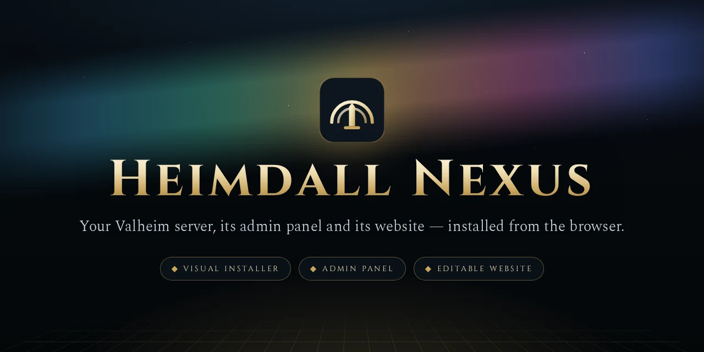
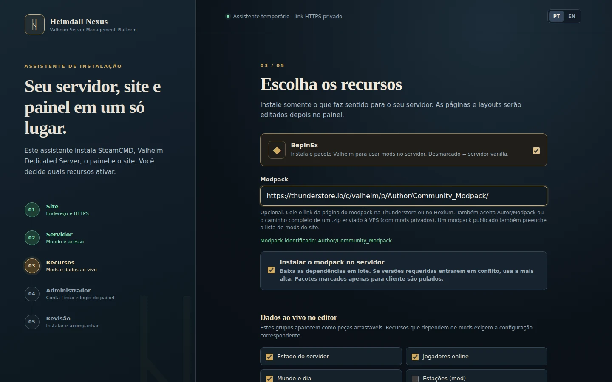
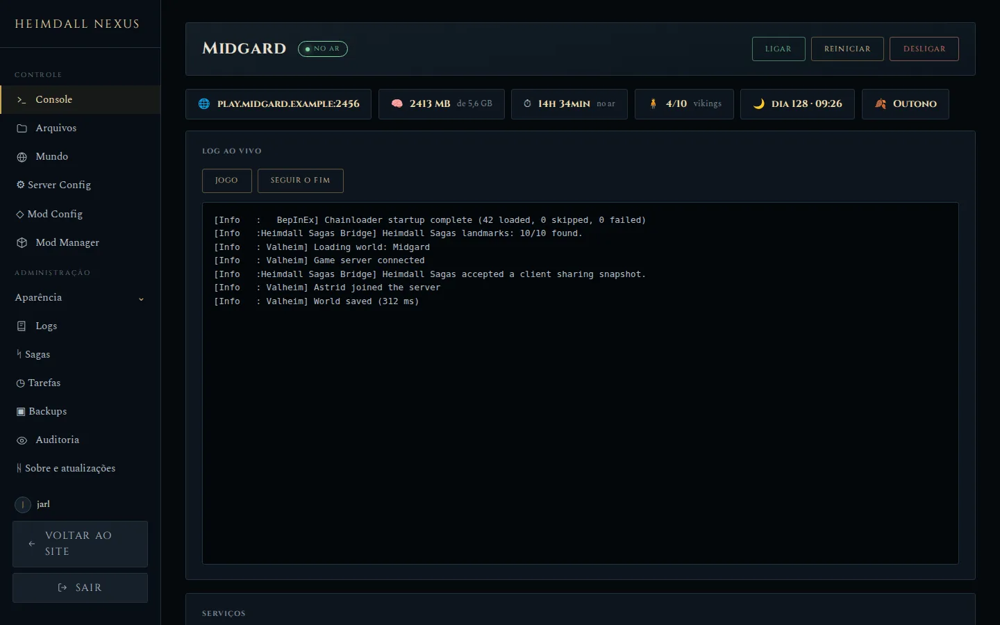
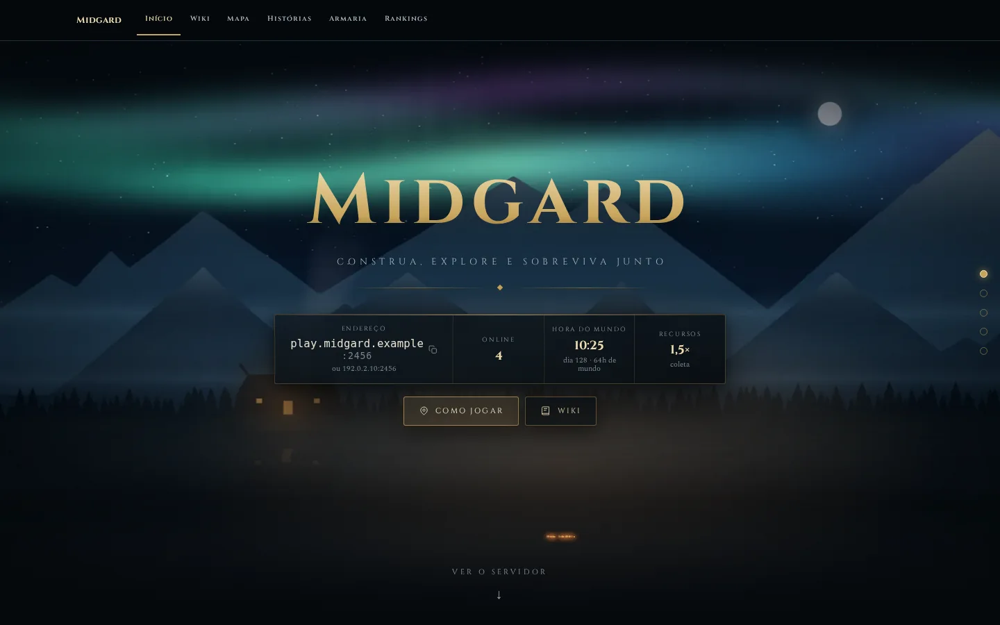
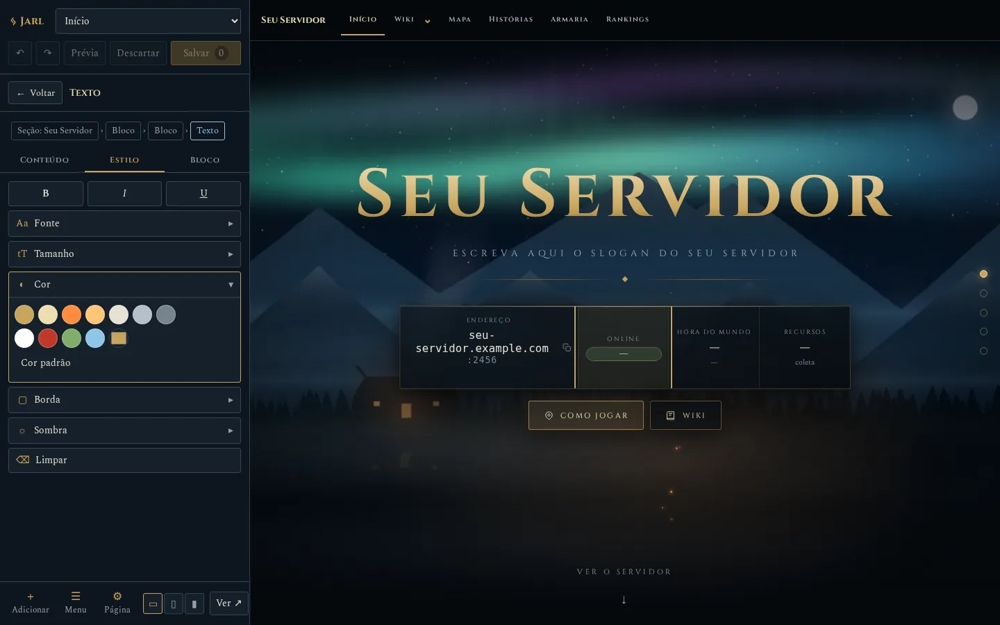
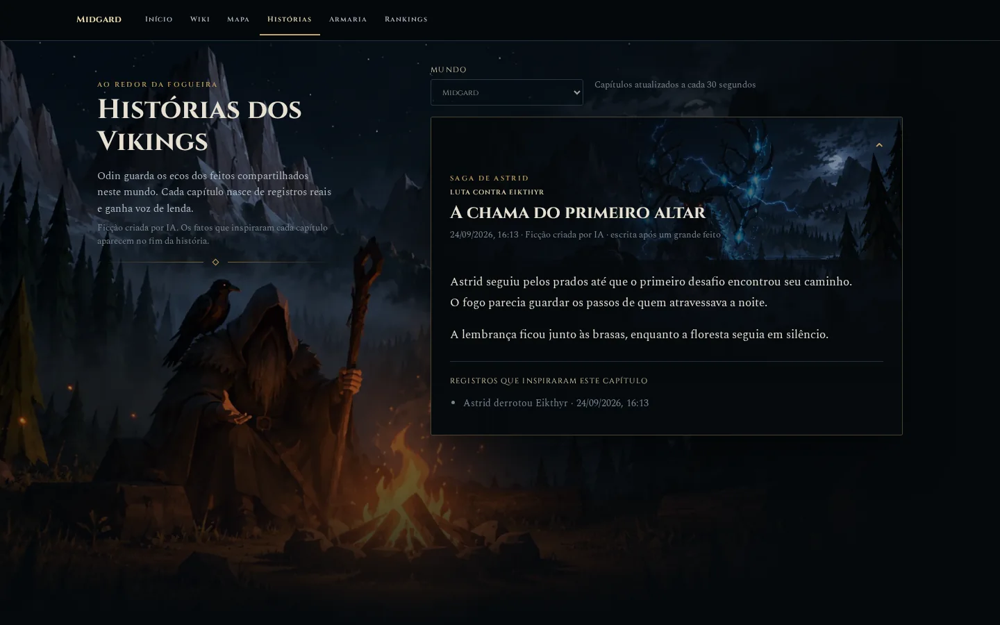
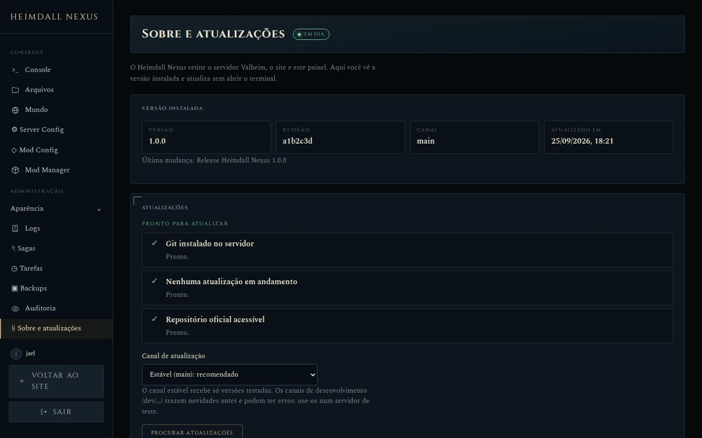

<div align="center">



### O guardião que tudo vê para o seu servidor de Valheim

Instale um servidor dedicado de Valheim, um painel no navegador e um site editável visualmente —<br>
num único assistente guiado, no Linux (Ubuntu ou Debian) ou no Windows.

[**Começo rápido**](#começo-rápido) · [**Wiki**](https://github.com/brkihel/Heimdall-Nexus/wiki/Inicio) · [**Read in English**](README.md)

[](LICENSE)
[](https://valheim.com/support/a-guide-to-dedicated-servers/)
[](#começo-rápido)
[](https://www.python.org/)
[](CHANGELOG.md)

</div>

---

## Instale pelo navegador

O instalador roda no seu servidor, Linux ou Windows, e abre no seu navegador. São cinco telas: endereço do site, mundo e senha, mods e dados ao vivo, conta de administrador e revisão. Ele baixa o SteamCMD e o Valheim, instala o BepInEx e o seu modpack se você quiser, e mostra cada etapa enquanto acontece.



## Cuide do servidor por um painel só

Ligue, desligue e reinicie o jogo, acompanhe o log ao vivo, edite arquivos e configurações de mods, instale e atualize mods, faça wipe ou troque o mundo, agende reinícios e backups e restaure qualquer backup com um clique. Ações arriscadas pedem confirmação numa caixa do próprio painel, e toda mudança fica registrada na auditoria.



## Dê à sua comunidade um site de verdade

Um site rápido com estado do servidor ao vivo, jogadores online, hora do mundo e a lista de mods. Defina nome, logo, favicon e cores em **Aparência** e edite qualquer página no **Layout Editor**: clique em algo da página e aparecem só as ferramentas daquilo, nas abas Conteúdo, Estilo e Bloco. Crie páginas a partir dos modelos wiki ou vazio e organize o menu do site arrastando. Sem código e sem planilhas.





<sub>As capturas usam dados de exemplo.</sub>

## Começo rápido

Linux e Windows têm suporte completo: o Heimdall instala a mesma coisa nos dois, com o mesmo assistente, e o painel, o site e as Sagas funcionam igual. Não
sabe qual escolher? Numa VPS alugada, prefira o Linux; no seu próprio PC com
Windows, use o Windows. A comparação completa está em
[**Instalação**](https://github.com/brkihel/Heimdall-Nexus/wiki/Instalacao).

### Linux (Ubuntu ou Debian)

Numa máquina nova com **Ubuntu ou Debian x86-64** e Python 3.10+:

```bash
sudo apt update && sudo apt install -y git
git clone https://github.com/brkihel/Heimdall-Nexus.git
cd Heimdall-Nexus
sudo ./deploy/install.sh
```

O terminal mostra um link privado para o instalador. Abra no seu navegador e siga as cinco telas.

| Como abrir o instalador | Quando usar |
|---|---|
| `install.sh` | Padrão. Link HTTPS temporário pela Cloudflare, conferido antes de aparecer. |
| `install.sh --direct` | Máquina numa rede de confiança, como uma VM da sua rede local. Link HTTP para o IP dela. |
| `install.sh --local-only` | Sem serviço externo. Encaminhe a porta com `ssh -L 8765:127.0.0.1:8765 usuario@servidor`. |

Depois entre em `https://seu-dominio/jarl/entrar`. Passo a passo completo: [**Instalação no Linux**](https://github.com/brkihel/Heimdall-Nexus/wiki/Instalacao-Linux).

### Windows

Em **Windows 10 (1809+), 11 ou Server 2019/2022, 64 bits**, com o
[Git para Windows](https://git-scm.com/download/win) instalado. Abra o
**PowerShell como administrador**:

```powershell
git clone https://github.com/brkihel/Heimdall-Nexus.git C:\HeimdallNexus-src
cd C:\HeimdallNexus-src
powershell -ExecutionPolicy Bypass -File .\deploy\windows\install.ps1
```

O script instala um Python privado do Heimdall (fora do PATH) e abre o
assistente no navegador do próprio PC. O servidor, o painel e o site viram
serviços do Windows, cada um com uma conta própria e sem privilégios. O Caddy
serve o site, com HTTPS automático. Depois entre em `http://seu-endereço/jarl/entrar`.

Passo a passo para quem está começando, com referência rápida para veteranos:
[**Instalação no Windows**](https://github.com/brkihel/Heimdall-Nexus/wiki/Instalacao-Windows).

## Recursos

<table>
<tr>
<td width="50%" valign="top">

**Servidor de jogo**
- Valheim Dedicated Server pelo SteamCMD, como serviço do systemd ou do Windows
- BepInEx opcional, com modpacks da Thunderstore ou do Hexium (é só colar o link)
- Seu próprio modpack `.zip`, com mods privados
- Server Config: nome, mundo, porta, senha, modificadores, admins, whitelist e banidos, com as opções de inicialização resultantes à vista
- Wipe de mundo com nome, seed e modificadores novos, ou troca por um mundo enviado

</td>
<td width="50%" valign="top">

**Dia a dia**
- Console ao vivo, gerenciador de arquivos, editor de configurações de mods e Logs do chat e da administração
- Mod Manager: instalar, atualizar e remover mods, com backup verificado antes de cada mudança
- Atualizar o Heimdall pelo Jarl, com progresso, códigos de erro e canais estável ou de desenvolvimento
- Tarefas: rotinas cron para reiniciar, ligar, desligar e fazer backup
- Backups para baixar, restaurar, travar e apagar

</td>
</tr>
<tr>
<td width="50%" valign="top">

**Site**
- Estado ao vivo, jogadores, relógio do mundo e lista de mods atualizada pelo Hexium em **Modpack**
- Layout Editor com versões, desfazer e prévias para compartilhar
- Nome, logo, favicon, fundo e uma tabela global de cores
- Menu compartilhado com submenus, editado arrastando, com prévia ao vivo
- Páginas de mapa, histórias, armaria e rankings, e páginas a partir dos modelos wiki ou vazio
- Quem está logado no Jarl vê os atalhos **Jarl** e **Layout Editor** em todas as páginas

</td>
<td width="50%" valign="top">

**Seguro por padrão**
- Senha do jogo obrigatória; só pode sair com um mod de servidor sem senha
- Contas Linux separadas para o jogo e o painel
- Links de instalação de uso único; ações privilegiadas passam por um executor auditado
- Sem telemetria do núcleo; histórias opcionais enviam fatos consentidos ao provedor escolhido

</td>
</tr>
</table>

## Extensão Sagas opcional

Sagas acrescenta mapa Birds Eye, momentos dos Vikings, uma **Armaria** com o
perfil de cada Viking (retrato tirado pelo próprio jogo, equipamento com ícones,
barra rápida e detalhes dos itens), rankings e capítulos com ajuda de IA ao
site. O administrador liga cada recurso no Jarl; os jogadores escolhem
separadamente se compartilham perfil, mapa, posição e fatos para histórias. As
chaves dos provedores ficam no servidor. O
[guia Sagas](https://github.com/brkihel/Heimdall-Nexus/wiki/Sagas-PT)
explica instalação, consentimento e o que ainda está no roteiro.



Veja as [notas de versão](CHANGELOG.md).

## Documentação

Tudo está na [**wiki**](https://github.com/brkihel/Heimdall-Nexus/wiki/Inicio), em português e inglês:
[Instalação](https://github.com/brkihel/Heimdall-Nexus/wiki/Instalacao) ([Linux](https://github.com/brkihel/Heimdall-Nexus/wiki/Instalacao-Linux), [Windows](https://github.com/brkihel/Heimdall-Nexus/wiki/Instalacao-Windows)) ·
[Configuração](https://github.com/brkihel/Heimdall-Nexus/wiki/Configuracao) ·
[Operação](https://github.com/brkihel/Heimdall-Nexus/wiki/Operacao) ·
[Editor visual](https://github.com/brkihel/Heimdall-Nexus/wiki/Editor-Visual) ·
[Sagas](https://github.com/brkihel/Heimdall-Nexus/wiki/Sagas-PT)

## Atualizar

Pelo painel: **Jarl → Sobre e atualizações → Procurar atualizações**. Você vê a lista de mudanças e aprova a versão exata; o painel se atualiza e volta sozinho.



As capturas usam dados ilustrativos; não mostram um servidor real.

Pelo terminal, num servidor já instalado:

```bash
cd ~/Heimdall-Nexus && git pull --ff-only && sudo ./deploy/update.sh
```

No Windows, pelo PowerShell como administrador:

```powershell
cd C:\HeimdallNexus-src; git pull --ff-only
& "$env:ProgramFiles\HeimdallNexus\venv\Scripts\python.exe" deploy\windows\update.py
```

Atualiza o painel e as ferramentas sem mexer em mundos, mods ou conteúdo do site, e não reinicia o Valheim. Se a ponte Sagas mudou, reinicie o jogo quando for conveniente.

## Licença

O Heimdall Nexus tem **código aberto para consulta** sob a [PolyForm Noncommercial License 1.0.0](LICENSE). Você pode usar, estudar, modificar e compartilhar para qualquer fim **não comercial**: rodar o seu servidor ou o da sua comunidade, projetos pessoais, estudo e organizações sem fins lucrativos ou públicas. **Vender ou usar comercialmente não é permitido.** Para uso comercial, fale com o autor.

Valheim é marca da Iron Gate AB. As imagens de fundo padrão do site são arte original feita para o Heimdall Nexus (desenhadas por `.github/art/landscapes.html`) e fazem parte desta licença. O Heimdall Nexus não é afiliado à Iron Gate AB nem à Coffee Stain.

<div align="center">
<br>
<sub>Feito por <a href="https://github.com/brkihel">BRKiHeL</a> para a comunidade de Valheim.</sub>
</div>
